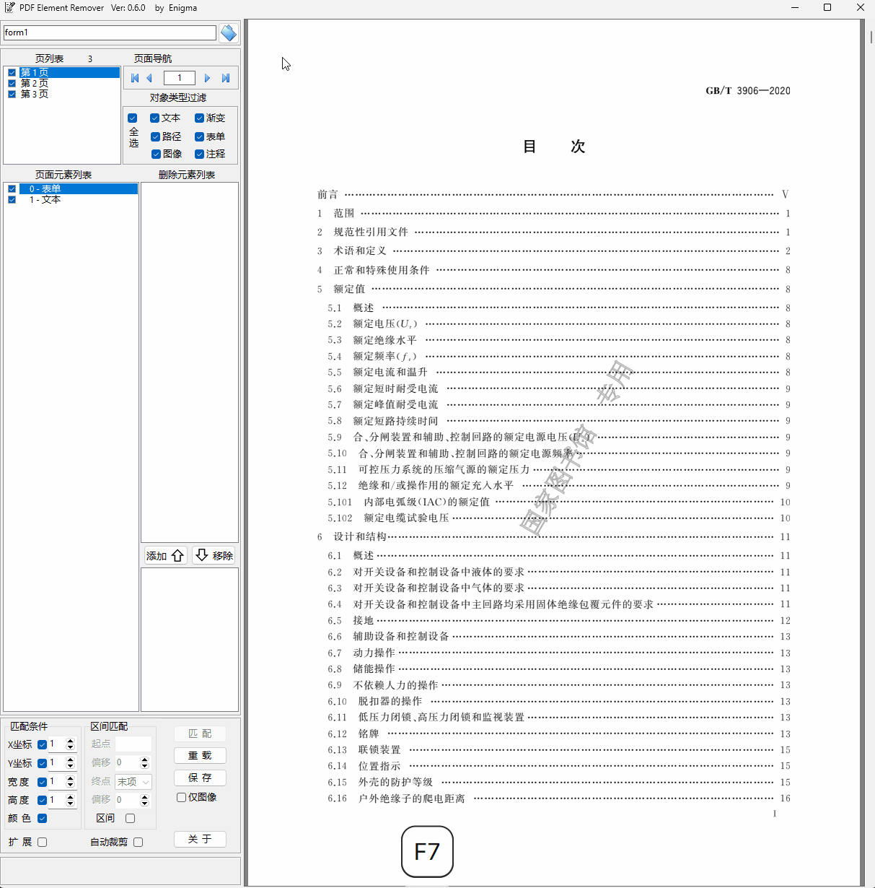
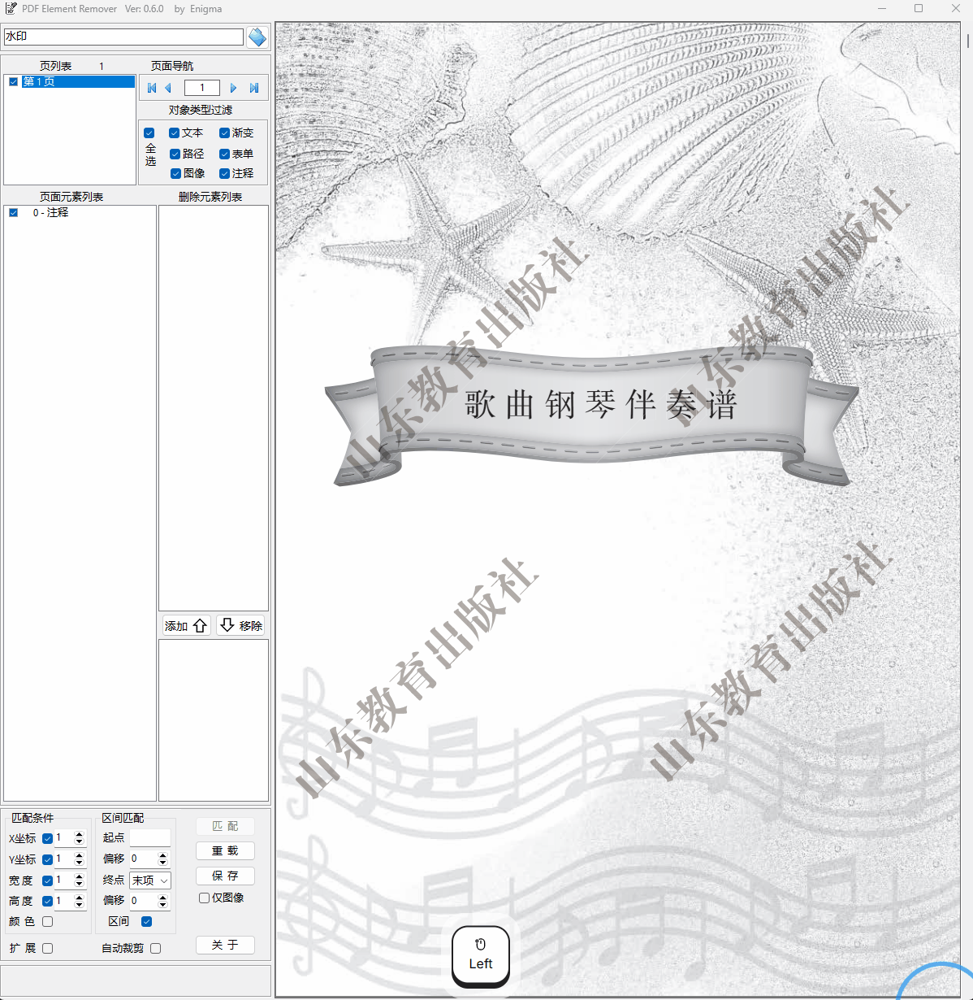

这是一个可视化的PDF元素删除工具，可以对全部页面中的元素(包括PDF水印)按类型、坐标、颜色进行匹配、无损删除。

(演示：https://wwbft.lanzouw.com/b0xx6xxwb 密码:3721)

This is a professional visual PDF element removal tool capable of non-destructively identifying and eliminating elements (including watermarks) across all pages by matching criteria such as element type, coordinates, and color attributes.

使用说明：
       本工具左侧为操作面板，右侧为页面浏览区。
一、文件选择
1.直接拖曳PDF文件到程序图标或程序窗口。
2.点击【文件】按钮，在弹出的文件浏览器中选择文件。
3.鼠标经过【文件】按钮左侧编辑框，会下弹出文件列表，在文件列表中选择文件，列表的目录是最后打开PDF的目录，选择完成后，文件列表自动隐藏。
二、PDF浏览
        页面浏览区显示所选择的PDF文件，页列表显示所有页索引及高亮当前页，可通过页面导航按钮、鼠标滚轮、拖动窗口最右侧滚动条或直接在页列表中选择几种方式，进行翻页浏览。
三、元素过滤
        PDF元素有多种类型构成，为了方便选择某些元素，组合【文本】、【路径】、【图像】、【渐变】、【表单】、【注释】复选框，过滤掉不需显示的元素。
快捷键：如只单选【路径】，按住Ctrl再点击【路径】。
四、元素选择
1.在元素列表中选择
        鼠标在列表中移动时，右侧浏览页面中对应条目的元素会显示出矩形框，认可后，左键点击列表中条目，该条目进入删除元素列表，同时浏览页面中该元素被删除，直观被删除的效果，再次左键该条目，则删除被恢复。
       如右键点击列表中条目，则该条目进入选择列表，为后面的全文匹配作准备，同时浏览页面闪烁，交替显示删除前后的效果。
快捷键：左键点击某条目后（如15），按住Shift再点击其它（如100），则2次选择条目之间的所有条目被删除（15-100）,如按住Shift键再右键某条目，则恢复2条目间被删除的条目。（左键15->Shift+左键100->Shift+右键80，先删除15-100，再恢复15-80，等于删除了81-100）
2.在浏览页面中选择
a.单击左键->移动鼠标->单击左键：画一直线，直线所经过的元素被选择，对应条目进入选择列表，对应元素闪烁。
b.按住鼠标，拖曳出一矩形，被包裹在矩形中的元素被选中。
c.按住Ctrl点击左键，可画出一任意四边形，四边形包裹的元素被选中。（元素必须被矩形或四边形完全包裹才算选中）
d.在需选择的元素上双击左键
e.如需删除从某对象开始一直到最后，按住Ctrl再左键某对象；如需删除从某对象的下一个对象开始直到最后，按住Shift再左键某对象。
删除元素列表中的条目，是最终要被删除的，如有误选，可双击条目取消。
选择列表中的误选，可在条目上右键删除。
如要取消选择列表中所有条目，可按ESC键或在浏览区鼠标右键即可。
五、元素匹配
1.匹配是根据当前页面加入选择列表的元素为基准，结合匹配条件，点击【匹配】按钮后，对PDF所有页面进行匹配，匹配合适的元素均被送到删除元素列表。
进行全部页面匹配前，可根据情况修改匹配条件，如取消所有条件，则只根据类型匹配。（如删除PDF中所有的表单，可把条件均取消，选择任意一个表单到选择列表，再匹配即可。）
2.区间匹配
有时待删除的元素比较多，且在某一区间里，这时可选择区间匹配。起点先选择某一元素，如想从这个元素的下一个作为开始，偏移就设1；终点有是种选择，默认是末项，如想留最后2个不删除（比如页码），偏移就设为-2。
六、扩展
对于表单和注释，之前只能作为个体参与操作，选择【扩展】后，表单和注释中的元素将被展开，注意：由于表单的容器被删除，表单的某些特有属性不再起作用，有的特殊效果会消失，一般情况下没问题。
七、自动剪切
对于有些带剪切路径的PDF，删除元素后，下一层的元素会留下剪切痕迹，这个功能会尝试修复它，但并不对所有的PDF都有效。
八、保存
匹配完成后，点【保存】，会在原文件目录生成一个【原文件名+日期时间.pdf】文件。
九、其它
程序退出后，窗口大小及位置、最后打开的文件目录、【展开】、【自动剪切】的设置会被保存，下次打开后自动设置。

