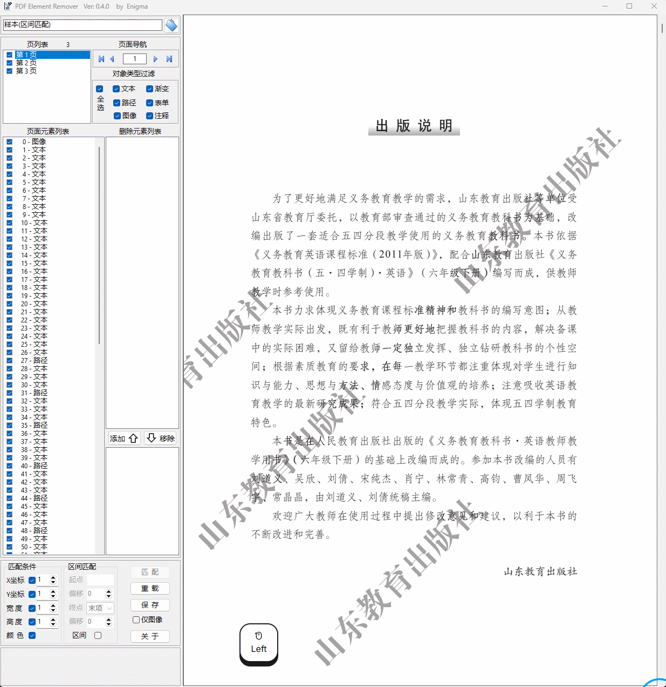

这是一个可视化的PDF元素删除工具，可以对全部页面中的元素(包括PDF水印)按类型、坐标、颜色进行匹配、无损删除。(演示：https://wwbft.lanzouw.com/b0xx6xxwb
密码:3721)
This is a professional visual PDF element removal tool capable of non-destructively identifying and eliminating elements (including watermarks) across all pages by matching criteria such as element type, coordinates, and color attributes.

